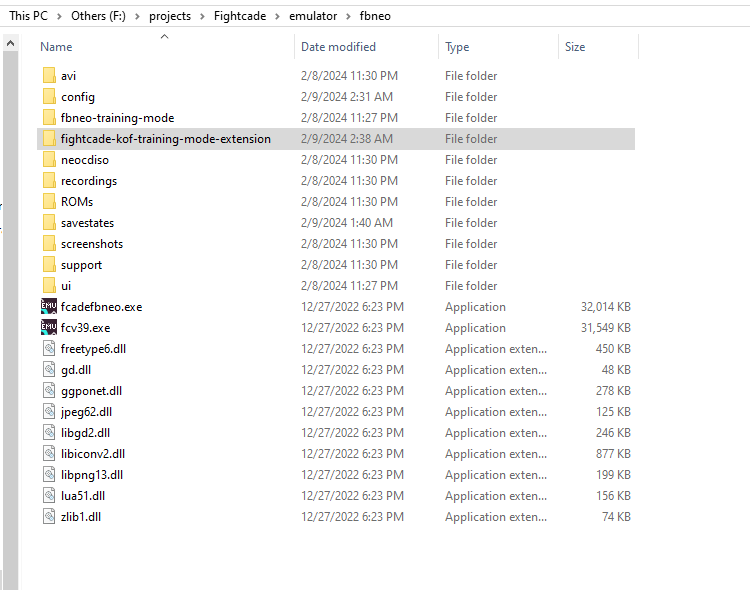
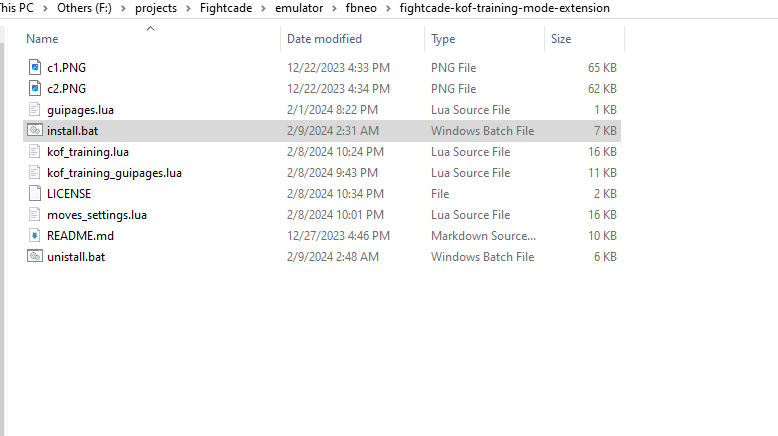

  <h3><b>FightCade Training Mode extension for KOF</b></h3>

 This is an extension for the fighcade Training Mode On the KoF Games, it is tested and
developed mainly for kof 98, but it should work in other KOF's until 2k2 (had a little test on this but don't take my word for it)
most KOF  have the same memory addresses  and functions on the original script <a href="https://github.com/peon2/fbneo-training-mode">fbneo-training-mode</a>

## Installation Guide

### 1. Download Extension
- Download the extension files from the [GitHub repository](https://github.com/willococa/fightcade-kof-training-mode-extension).

### 2. Locate Fightcade Folder
- Navigate to the directory where Fightcade is installed on your system.

### 3. Access FBNeo Folder
- Inside the Fightcade directory, locate and open the `fbneo` folder.

### 4. Copy Extension Folder
- Copy the folder containing the extension files (including `install.bat`) into the `fbneo` directory.
it should be inside another folder not the files directly put in the `fbneo` directory.

 

 

### 5. Run Installation Script
- Double-click on the `install.bat` file to execute it. This script will copy the necessary files to the correct locations.

### 6. Follow Prompts
- The script may prompt you to confirm the installation. Follow the on-screen instructions to proceed.

### 7. Verify Installation
- Once the script completes, verify that the files have been copied to the appropriate locations.

### 8. Enjoy the Extension
- With the installation complete, you can now enjoy the enhanced features provided by the Fightcade KOF Training Mode Extension.
### 2. Uninstallingn Script
- Double-click on the `uninstall.bat` file to execute it. This script will remove all the changes you made.
## Captures

 

 
<!-- ACKNOWLEDGEMENTS -->

## 🙏 Acknowledgments

> 

I would like to thank the FightCade Devs for their fabulous work and all the other developers and technologies tha are involved or used in the project, this is just a little extension of their work
Also expecifically to the <a href="https://github.com/peon2/fbneo-training-mode">Fbneo Training Mode</a>

(<a href="#readme-top">back to top</a>)

<!-- LICENSE -->

## 📝 License 

This project is [BSD 2-Clause License](./LICENSE) licensed. I think this is the license this script should inherit, but i honestly don't know how this expecific license work, just please note that this work is not based in my original code and is just an extension on the work of others, feel free to extend it too and share it with the community, don't sell it.

(<a href="#readme-top">back to top</a>)
