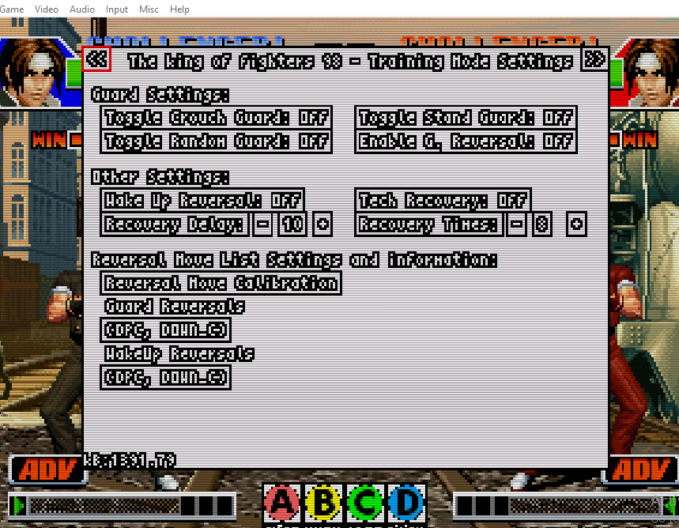
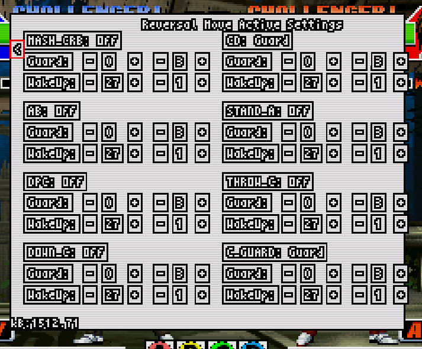

  <h3><b>FightCade Training Mode extension for KOF</b></h3>

 

 
<!-- ACKNOWLEDGEMENTS -->

## 🙏 Acknowledgments

> 

I would like to thank the FightCade Devs for their fabulous work and all the other developers and technologies tha are involved or used in the project, this is just a little extension of their work

(<a href="#readme-top">back to top</a>)

<!-- LICENSE -->

## 📝 License 

This project is [MIT](./LICENSE) licensed.

_NOTE: we recommend using the [MIT license](https://choosealicense.com/licenses/mit/) - you can set it up quickly by [using templates available on GitHub](https://docs.github.com/en/communities/setting-up-your-project-for-healthy-contributions/adding-a-license-to-a-repository). You can also use [any other license](https://choosealicense.com/licenses/) if you wish._

(<a href="#readme-top">back to top</a>)
